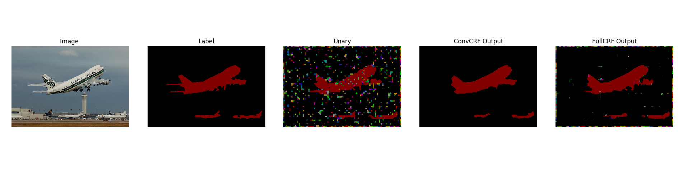

ConvCRF
========
This repository contains the reference implementation for our proposed Convolutional CRFs in PyTorch (Tensorflow planned). The two main entry-points are [demo.py](demo.py) and [benchmark.py](benchmark.py). Demo.py performs ConvCRF inference on a single input image while Benchmark.py compares ConvCRF with FullCRF. Both scripts plot their, yielding an output as shown below.

Requirements
-------------

Plattform: Linux, python3 >= 3.4 (or python2 >= 2.7), [cython]
Python Packages: numpy, imageio, cython, scikit-image, matplotlib
Optional: pyinn, pydensecrf

